

<h1>osTicket - Prerequisites and Installation</h1>
This tutorial outlines the prerequisites and installation of the open-source help desk ticketing system osTicket. 

<h2>Environments and Technologies Used</h2>

- Microsoft Azure (Virtual Machines/Compute)
- Remote Desktop
- Internet Information Services (IIS)

<h2>Operating Systems Used </h2>

- Windows 10</b> (22H2)

<h2>List of Prerequisites</h2>

- Azure Virtual Machine
- osTicket Installation files
- Heidl SQL

<h2>Installation Steps</h2>

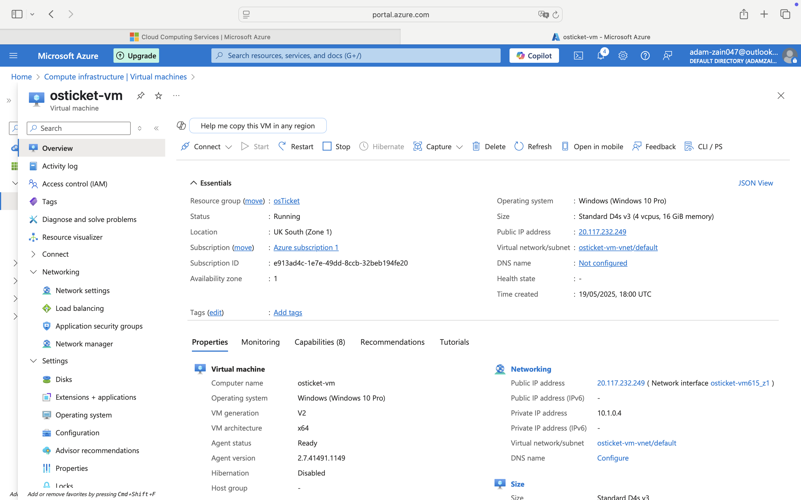

Start by provisioning an Azure VM in the osticket resource group named osticket-vm, using the Standard_D4s_v3 SKU (4 vCPUs, 16 GiB RAM) on Windows 10 Pro 22H2. This provides a dedicated, high-performance environment for IIS, PHP, and MySQL while keeping the host machine isolated and secure.

 

Next, retrieve the VM’s public IP from the Azure portal and launch Microsoft Remote Desktop on your Mac. Create a new connection named osticket-vm, paste the IP into the PC name field, and enter your administrator credentials to log in.

 

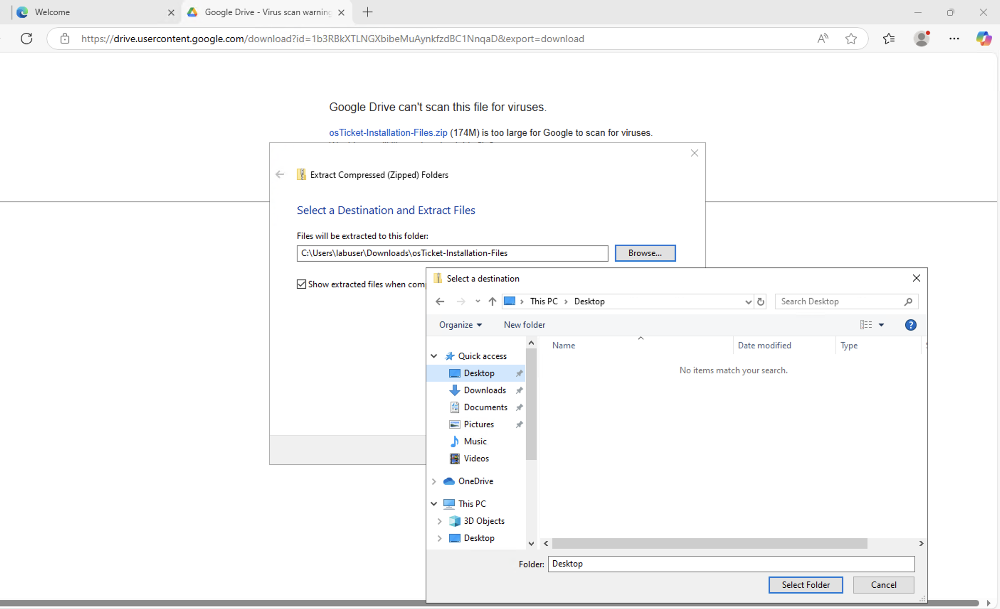      

From the official GitHub repository, download the latest osTicket ZIP release, extract its contents, rename the extracted folder to osTicket-Installation-Files, and move it to the desktop for easy access - https://drive.google.com/uc?export=download&id=1b3RBkXTLNGXbibeMuAynkfzdBC1NnqaD

 

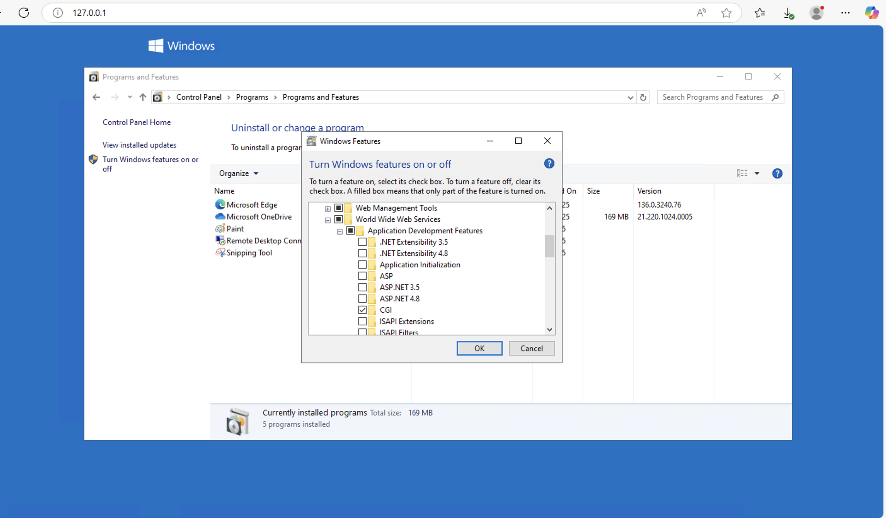      

Next, enable the CGI module in IIS so PHP-CLI scripts and other CGI applications can run. Open Control Panel → Programs → Programs and Features, click Turn Windows features on or off, then expand Internet Information Services → World Wide Web Services → Application Development Features, check CGI, and click OK to install.

 

Open the osTicket-Installation-Files folder on the desktop, double-click PHPManagerForIIS_V1.5.0.msi, and follow the installer’s on-screen instructions. When the setup finishes, PHP Manager will appear in the IIS console for PHP configuration.

 

Open the osTicket-Installation-Files folder on the desktop, double-click rewrite_amd64_en-US.msi, and follow the on-screen prompts. After installation, the URL Rewrite option will appear in the IIS console.

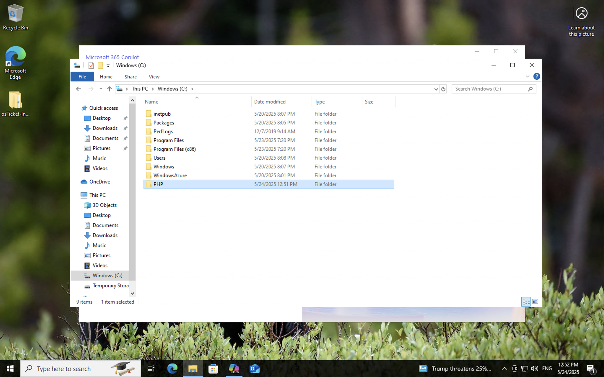 

Open File Explorer, navigate to the C: drive, right-click in the blank area, choose New → Folder, name it php, and press Enter. This directory will hold your PHP binaries.

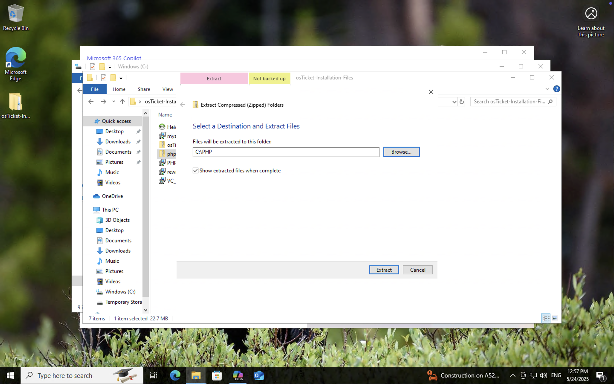 

Extract the php-7.3.8-nts-Win32-VC15-x86.zip archive from your osTicket-Installation-Files folder directly into C:\php so that all PHP files unpack into that directory.

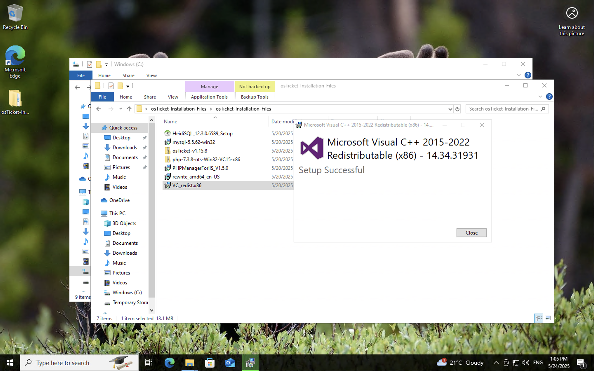 

Open the osTicket-Installation-Files folder, double-click VC_redist.x86.exe, and follow the installer’s on-screen instructions. This installs the required Visual C++ runtime for PHP.

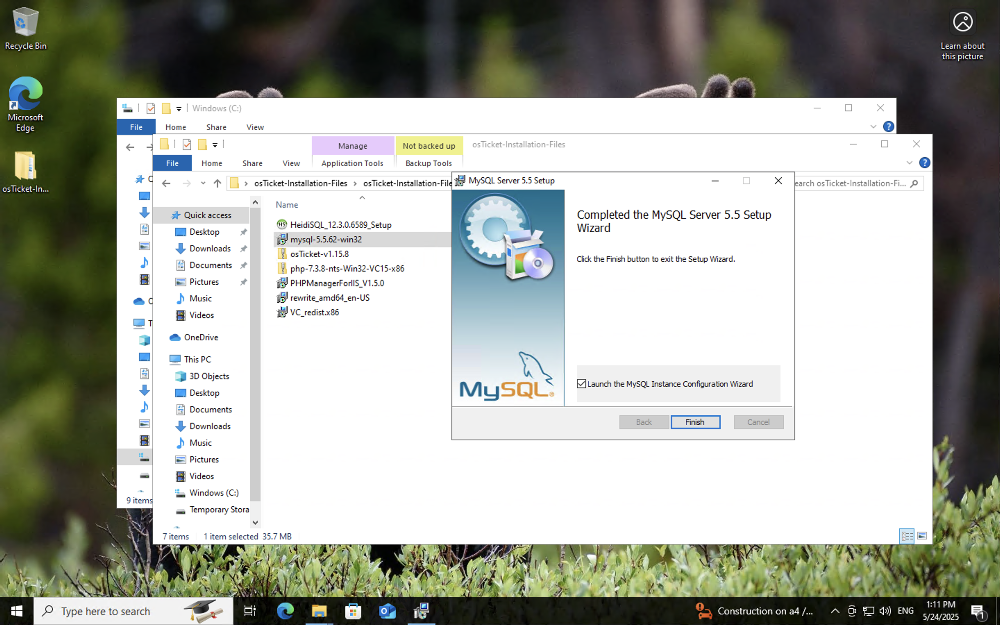 

Open the osTicket-Installation-Files folder, double-click mysql-5.5.62-win32.msi, select Typical Setup, ensure Launch Configuration Wizard is checked, and complete the install. In the Configuration Wizard choose Standard Configuration, set Username to root and Password to root, then finish the wizard.

 

Open IIS Manager with administrative rights, then click PHP Manager. Choose Register new PHP version, click the browse button (⋯), navigate to C:\PHP\php-cgi.exe, and click OK. Finally, restart IIS by selecting the server node and clicking Stop then Start in the Manage Server panel.

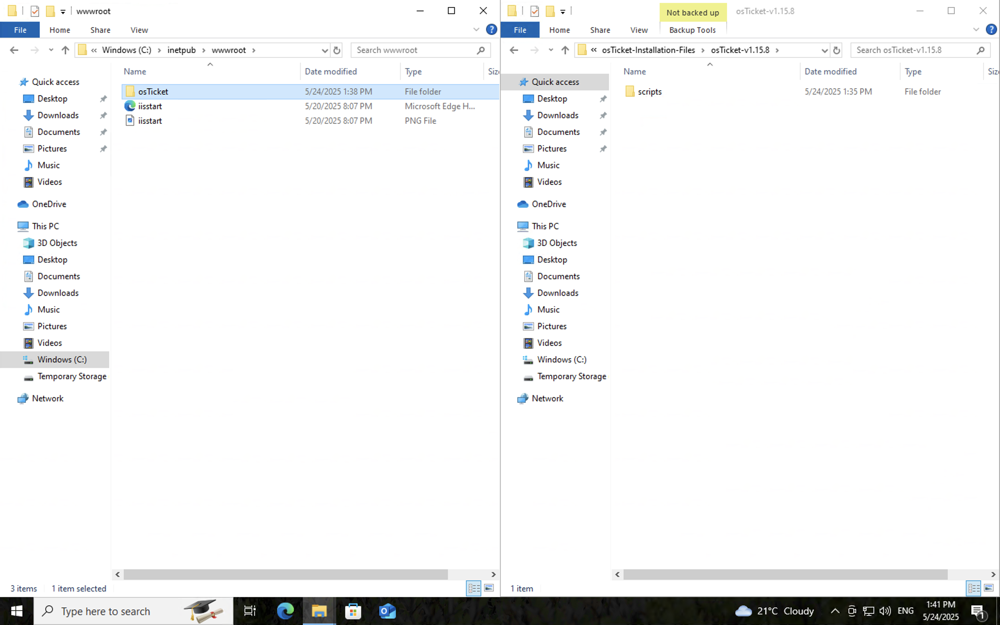 

In the osTicket-Installation-Files folder, unzip osTicket-v1.15.8.zip within the same folder. Then copy the resulting upload folder within the osTicket-v1.15.8.zip into C:\inetpub\wwwroot, and rename that folder to "osTicket".

 

Next, restart IIS to pick up the new files. In IIS Manager, select your server in the left pane, then click Stop in the right-hand Manage Server panel. Once it’s stopped, click Start to bring IIS back online. This ensures your freshly deployed osTicket site is served correctly.

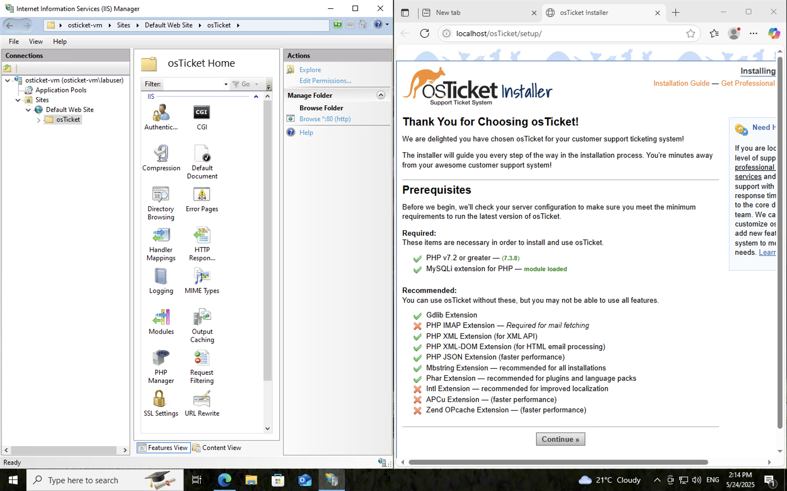 

Open IIS Manager, expand Sites in the left tree, select the osTicket site, and then click *Browse :80 in the Actions pane. Your default browser will launch and load the osTicket setup page.

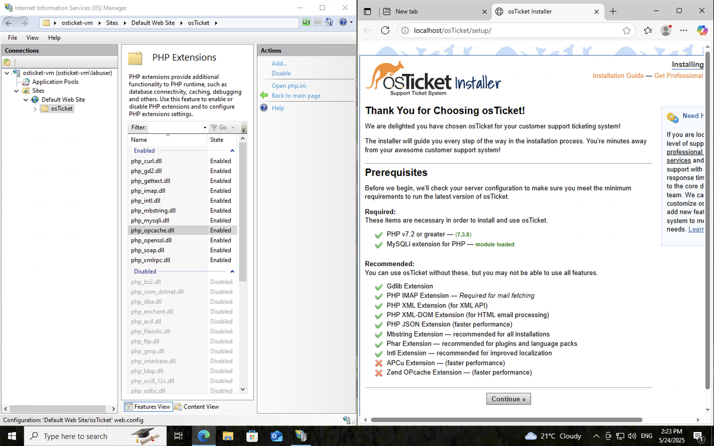 

If any PHP extensions are missing on the osTicket home page, open IIS Manager, expand Sites → osTicket, then double-click PHP Manager. In Enable or Disable Extensions, check php_imap.dll, php_intl.dll, and php_opcache.dll, click Apply, and finally restart the site (or IIS) to load the new extensions.

Open File Explorer and navigate to C:\inetpub\wwwroot\osTicket\include. Right-click ost-sampleconfig.php, choose Rename, and change the filename to ost-config.php. This creates your active configuration file for osTicket.

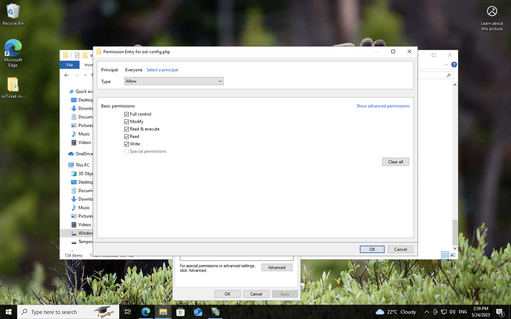

Next, secure the config file by granting write access to IIS. In File Explorer, go to C:\inetpub\wwwroot\osTicket\include, right-click ost-config.php and choose Properties. On the Security tab click Advanced, then Disable inheritance and select Convert inherited permissions into explicit permissions. Click Add, choose Select a principal, type Everyone, grant Full control, and click OK through all dialogs. This ensures IIS can read and write the config file as needed.

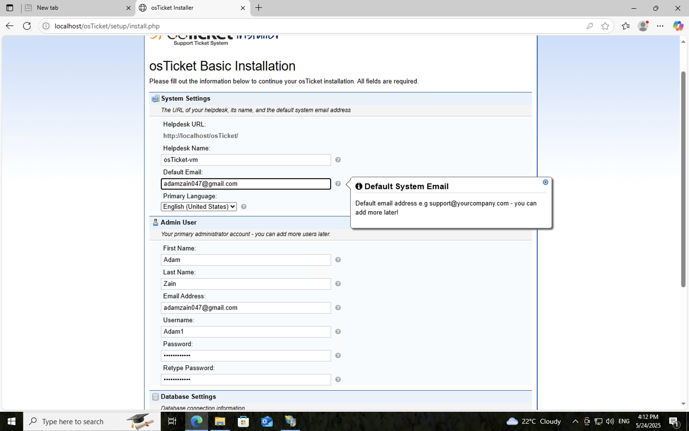

Open your browser to your osTicket site (e.g. http://localhost/osTicket), click Continue on the setup screen, and when prompted enter your administrator credentials (the email/username and password you chose during configuration).

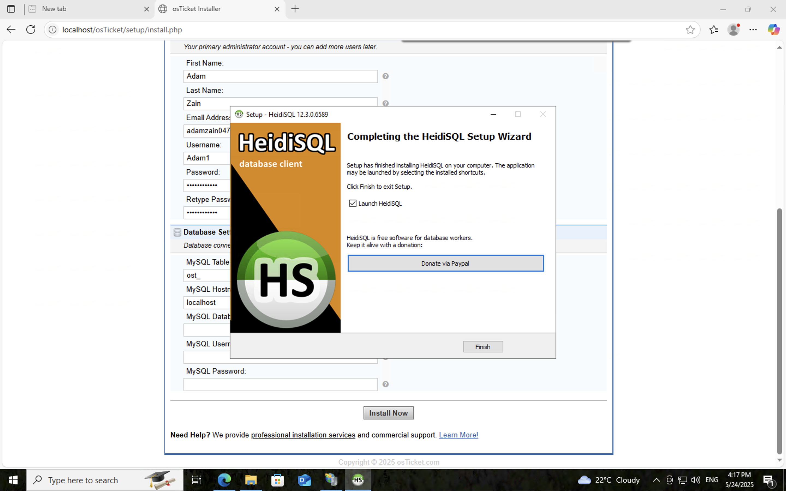

Next, install HeidiSQL by running its installer from the osTicket-Installation-Files folder. When HeidiSQL opens, click New Session, set Username to root and Password to root, then click Connect. Once connected, right-click on the server entry (e.g. localhost or Unnamed), choose Create new → Database, enter osTicket as the database name, and click OK.

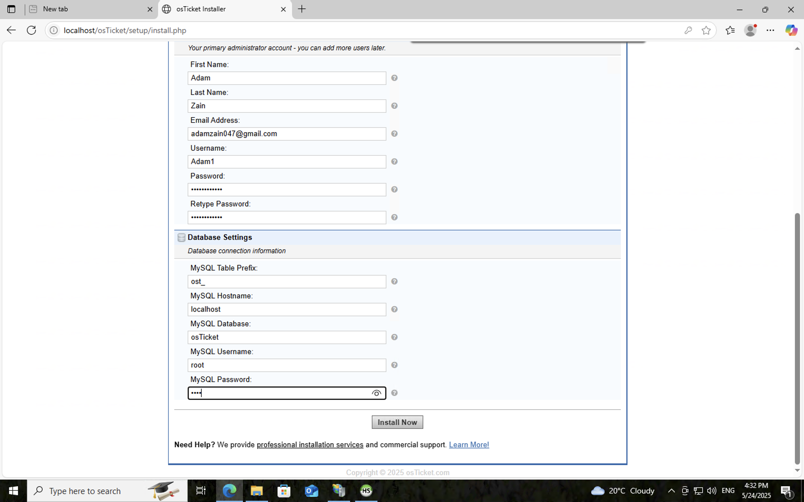

On the osTicket setup page, enter your database details—MySQL Database: osTicket, MySQL Username: root, MySQL Password: root—then click Install Now!. Once you see the “Congratulations” message, the installation is complete. Make sure the administrator email is different from the default system email to avoid routing conflicts.

